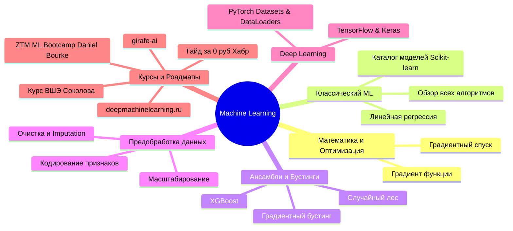

# 🗺️ Главный Индекс ML (Master Map of Content)

> [!abstract] Добро пожаловать в Second Brain по машинному обучению!
> Данное хранилище (Obsidian Vault) организовано по принципу графовых связей (Zettelkasten / MOC) и типизировано тегами. Ниже представлена полная карта знаний, структурированная по логическим блокам — от математической базы до прикладных фреймворков, буткемпов и курсов.

---

## 🧭 Навигация по разделам базы знаний

---

## 🗂️ Каталог заметок по модулям

### 0️⃣ Обзор и Мета-информация
- 🏷️ [[00.01 - Навигатор по Тегам|Навигатор по всем тегам и таксономии]]
- 🗺️ [[Вкатываемся в Machine Learning с нуля за 0 рублей (Roadmap)|Пошаговый трек обучения с нуля за 0 рублей]]
- ⚡ [[Все алгоритмы ML за 17 минут (Overview)|Все ключевые алгоритмы ML: Сравнительная матрица]]

### 1️⃣ Математика и Оптимизация
- 📐 [[Градиент функции (Function Gradient)|Градиент функции]] — частные производные, направление наискорейшего роста.
- 📉 [[Градиентный спуск (Gradient Descent)|Градиентный спуск]] — GD, SGD, Mini-batch, Learning Rate и сходимость.

### 2️⃣ Классическое машинное обучение
- 📈 [[Линейная регрессия (Linear Regression)|Линейная регрессия]] — МНК, аналитическое решение vs градиентный спуск, регуляризация ($L_1$, $L_2$).
- ⚡ [[Все алгоритмы ML за 17 минут (Overview)|Экспресс-обзор алгоритмов]] — классификация, регрессия, кластеризация.
- 📋 [[Scikit-learn - Каталог моделей и шпаргалка по выбору|Scikit-learn: Каталог моделей и руководство по выбору]] — 18 моделей классификации и регрессии с типами данных и примерами задач.

### 3️⃣ Ансамбли и Бустинги (Деревянные модели)
- 🌲 [[Случайный лес (Random Forest)|Случайный лес]] — бэггинг, метод случайных подпространств, OOB-оценка, уменьшение дисперсии.
- 🚀 [[Градиентный бустинг (Gradient Boosting)|Градиентный бустинг]] — последовательное обучение на антиградиент/остатки, борьба со смещением.
- ⚡ [[XGBoost|XGBoost (Extreme Gradient Boosting)]] — оптимизация 2-го порядка, гессианы, прунинг, регуляризация и GPU-ускорение.

### 4️⃣ Предобработка данных (Data Preprocessing)
- 🧹 [[Предобработка данных и Feature Engineering|Предобработка данных и Feature Engineering]] — пропуски, выбросы, One-Hot / Target Encoding, StandardScaler / RobustScaler.

### 5️⃣ Deep Learning и Фреймворки
- 🔥 [[PyTorch - Datasets & DataLoaders|PyTorch: Datasets & DataLoaders]] — абстракции `Dataset`, `DataLoader`, батчинг, многопоточность и стриминг данных.

### 6️⃣ Буткемпы, курсы и сообщества
- 🎓 [[ZTM - Complete Machine Learning & Data Science Bootcamp (Daniel Bourke)|ZTM ML Bootcamp (Daniel Bourke)]] — подробный практический трек (16 модулей): NumPy, Pandas, Matplotlib, Scikit-learn, проекты, Data Engineering и TensorFlow.
- 🎓 [[Курс Машинного Обучения ФКН ВШЭ (Евгений Соколов)|Курс ML ФКН ВШЭ]] — академический золотой стандарт машинного обучения в РФ.
- 🗺️ [[Вкатываемся в Machine Learning с нуля за 0 рублей (Roadmap)|Гайд по самостоятельному обучению (Хабр)]] — полная подборка бесплатных курсов и тренажеров.
- 🦒 [[girafe-ai|girafe-ai]] — открытые курсы от исследователей МФТИ, ВШЭ и ШАД.
- 🧠 [[Deep Machine Learning (deepmachinelearning.ru)|Deep Machine Learning]] — интерактивная база знаний по нейросетям.

---

## 📊 Рекомендуемый порядок изучения (Path)

1. **Фундамент**: [[Градиент функции (Function Gradient)]] $\to$ [[Градиентный спуск (Gradient Descent)]]
2. **Практический буткемп**: [[ZTM - Complete Machine Learning & Data Science Bootcamp (Daniel Bourke)]] (Python стек, Pandas, NumPy, Matplotlib)
3. **Классический ML и выбор моделей**: [[Линейная регрессия (Linear Regression)]] $\to$ [[Scikit-learn - Каталог моделей и шпаргалка по выбору]] $\to$ [[Предобработка данных и Feature Engineering]]
4. **Табличный SOTA**: [[Случайный лес (Random Forest)]] $\to$ [[Градиентный бустинг (Gradient Boosting)]] $\to$ [[XGBoost]]
5. **Нейросети & Deep Learning**: [[PyTorch - Datasets & DataLoaders]]
6. **Академическая глубина**: [[Курс Машинного Обучения ФКН ВШЭ (Евгений Соколов)]]
