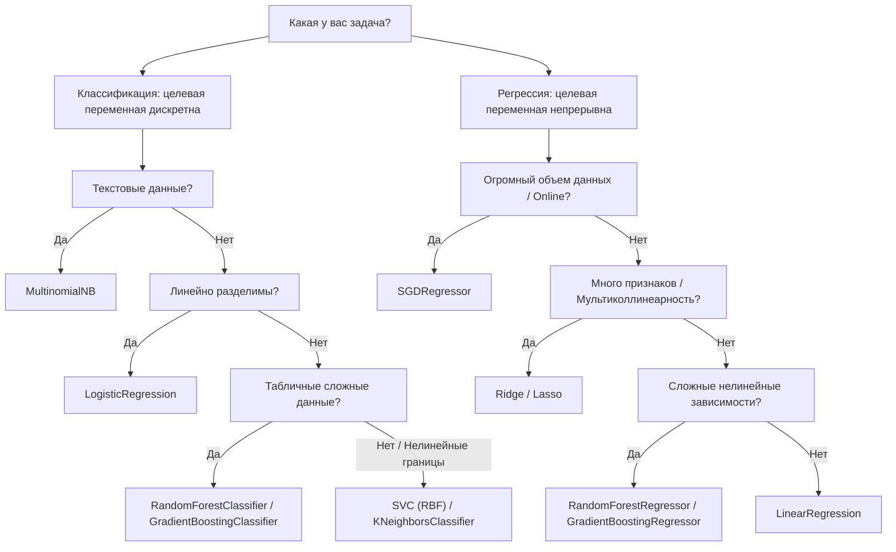

# 📋 Scikit-learn: Каталог моделей и руководство по выбору

> [!abstract] О материале
> Полный справочник по 18 ключевым алгоритмам машинного обучения библиотеки **Scikit-learn** для решения задач **Классификации (Classification)** и **Регрессии (Regression)**. Включает требования к типам данных, примеры прикладных задач, готовые строки импорта и рекомендации по применению.

---

## 🧭 Как выбрать модель: Сводная матрица

---

## 🎯 1. Задачи Классификации (Classification)

### 1. Logistic Regression (`LogisticRegression`)
- **Класс**: `from sklearn.linear_model import LogisticRegression`
- **Тип входных данных**: Числовые (непрерывные), отнормированные признаки; бинарные или One-Hot закодированные категории.
- **Целевая переменная**: Бинарная (`0/1`, `True/False`) или мультиклассовая.
- **Пример прикладной задачи**: Скоринг конверсии — предсказание, купит ли пользователь продукт на сайте (`да/нет`).
- **Особенности**: Выдает вероятности (`predict_proba`), легко интерпретируется через веса признаков, требует [[Предобработка данных и Feature Engineering|масштабирования признаков]].

### 2. KNeighborsClassifier (`KNeighborsClassifier`)
- **Класс**: `from sklearn.neighbors import KNeighborsClassifier`
- **Тип входных данных**: Числовые признаки строго одного масштаба.
- **Пример прикладной задачи**: Классификация видов растений/ирисов на основе физических промеров (длина и ширина лепестков).
- **Особенности**: Метрический алгоритм без фазы обучения ($O(1)$ на fit, $O(N)$ на инференс), чувствителен к проклятию размерности и выбросам.

### 3. DecisionTreeClassifier (`DecisionTreeClassifier`)
- **Класс**: `from sklearn.tree import DecisionTreeClassifier`
- **Тип входных данных**: Разнородные данные (числовые и категориальные), нормализация не требуется.
- **Пример прикладной задачи**: Кредитный скоринг — прогноз, примет ли клиент предложение по кредиту, с формированием прозрачных бизнес-правил (if-else).
- **Особенности**: Быстрое обучение, высокая интерпретируемость, но склонно к сильному переобучению без ограничения глубины (`max_depth`).

### 4. RandomForestClassifier (`RandomForestClassifier`)
- **Класс**: `from sklearn.ensemble import RandomForestClassifier`
- **Тип входных данных**: Разнородные данные (числовые и категориальные).
- **Пример прикладной задачи**: Классификация типов автомобилей или поломок оборудования по сенсорным данным.
- **Особенности**: [[Случайный лес (Random Forest)|Ансамбль независимых деревьев]], устойчив к шуму и переобучению, дает надежную оценку `feature_importances_`.

### 5. GradientBoostingClassifier (`GradientBoostingClassifier`)
- **Класс**: `from sklearn.ensemble import GradientBoostingClassifier`
- **Тип входных данных**: Разнородные табличные данные.
- **Пример прикладной задачи**: Прогнозирование оттока клиентов телекома или банка (churn prediction).
- **Особенности**: [[Градиентный бустинг (Gradient Boosting)|Последовательное исправление ошибок]], максимальное качество на таблицах, требует аккуратного подбора `learning_rate` и `n_estimators`.

### 6. Support Vector Classifier (`SVC` с RBF-ядром)
- **Класс**: `from sklearn.svm import SVC`
- **Тип входных данных**: Числовые, обязательно стандартизированные данные (`StandardScaler`).
- **Пример прикладной задачи**: Классификация изображений малого разрешения или биомедицинских маркеров.
- **Особенности**: Ищет разделяющую гиперплоскость с максимальным зазором (margin), RBF-ядро строит нелинейные границы, сложно масштабируется на выборки $> 50\,000$ строк.

### 7. Multilayer Perceptron (`MLPClassifier`)
- **Класс**: `from sklearn.neural_network import MLPClassifier`
- **Тип входных данных**: Числовые нормализованные признаки, разреженные векторы.
- **Пример прикладной задачи**: Распознавание рукописных цифр и символов (MNIST) на полносвязных слоях.
- **Особенности**: Классическая нейросеть прямого распространения с обратным распространением ошибки (Backpropagation).

### 8. Naive Bayes (`MultinomialNB`)
- **Класс**: `from sklearn.naive_bayes import MultinomialNB`
- **Тип входных данных**: Неотрицательные счетчики, частотные признаки (TF-IDF, Bag-of-Words).
- **Пример прикладной задачи**: Фильтрация спама, модерация комментариев и классификация новостей по темам.
- **Особенности**: Невероятно быстрый алгоритм, устойчив к огромным словарям признаков, базируется на формуле Байеса с предположением о независимости признаков.

---

## 📈 2. Задачи Регрессии (Regression)

### 9. Linear Regression (`LinearRegression`)
- **Класс**: `from sklearn.linear_model import LinearRegression`
- **Тип входных данных**: Непрерывные числовые данные.
- **Пример прикладной задачи 1**: Прогнозирование заработной платы соискателя на основе опыта работы, возраста и грейда.
- **Пример прикладной задачи 2**: Оценка объема продаж ритейлера в зависимости от рекламного бюджета на радио, ТВ и в интернете.
- **Особенности**: Аналитическое решение обычным методом наименьших квадратов (OLS), см. подробности в заметке [[Линейная регрессия (Linear Regression)]].

### 10. Stochastic Gradient Descent Regressor (`SGDRegressor`)
- **Класс**: `from sklearn.linear_model import SGDRegressor`
- **Тип входных данных**: Огромные числовые массивы данных, потоковые данные (out-of-core learning).
- **Пример прикладной задачи**: Прогнозирование потребления электроэнергии крупного региона в реальном времени.
- **Особенности**: Линейная модель, обучаемая с помощью [[Градиентный спуск (Gradient Descent)|стохастического градиентного спуска (SGD)]]. Метод `partial_fit()` позволяет дообучать модель батчами без загрузки всего датасета в память.

### 11. Регуляризованная линейная регрессия (`Ridge` и `Lasso`)
- **Класс**: `from sklearn.linear_model import Ridge, Lasso, ElasticNet`
- **Тип входных данных**: Числовые нормализованные признаки с высокой степенью корреляции.
- **Пример прикладной задачи**: Оценка стоимости элитной недвижимости с сотнями скоррелированных параметров (площадь, этаж, инфраструктура).
- **Особенности**:
  - `Ridge` ($L_2$): предотвращает взрыв весов и подавляет мультиколлинеарность.
  - `Lasso` ($L_1$): обнуляет неинформативные признаки, выполняя автоматический отбор признаков.

### 12. KNeighborsRegressor (`KNeighborsRegressor`)
- **Класс**: `from sklearn.neighbors import KNeighborsRegressor`
- **Тип входных данных**: Числовые масштабированные признаки.
- **Пример прикладной задачи**: Предсказание арендной платы квартиры по расстоянию до метро, площади и среднему доходу района.
- **Особенности**: Прогноз формируется как среднее (или взвешенное по расстоянию) значение целевой переменной $k$ ближайших соседей.

### 13. DecisionTreeRegressor (`DecisionTreeRegressor`)
- **Класс**: `from sklearn.tree import DecisionTreeRegressor`
- **Тип входных данных**: Числовые и категориальные данные.
- **Пример прикладной задачи**: Прогнозирование времени прибытия курьера (ETA) в зависимости от района, времени суток и загруженности дорог.
- **Особенности**: Кусочно-постоянная аппроксимация, не требует масштабирования, но не способна экстраполировать значения за пределы диапазона обучения.

### 14. RandomForestRegressor (`RandomForestRegressor`)
- **Класс**: `from sklearn.ensemble import RandomForestRegressor`
- **Тип входных данных**: Числовые и категориальные признаки.
- **Пример прикладной задачи**: Прогнозирование урожайности сельскохозяйственных культур по агрометеорологическим показателям.
- **Особенности**: Бэггинг над деревьями регрессии, усреднение предсказаний сотен деревьев минимизирует дисперсию ошибки.

### 15. GradientBoostingRegressor (`GradientBoostingRegressor`)
- **Класс**: `from sklearn.ensemble import GradientBoostingRegressor`
- **Тип входных данных**: Числовые и категориальные признаки.
- **Пример прикладной задачи**: Прогнозирование стоимости медицинских услуг и выплат по страховым случаям.
- **Особенности**: Последовательное обучение на невязки ошибок (антиградиент MSE/MAE/Huber Loss). Обеспечивает высшую точность среди классических алгоритмов.

### 16. Support Vector Regressor (`SVR` с RBF-ядром)
- **Класс**: `from sklearn.svm import SVR`
- **Тип входных данных**: Числовые стандартизированные данные.
- **Пример прикладной задачи**: Оценка рыночной стоимости подержанных автомобилей по техническим характеристикам.
- **Особенности**: Использует $\varepsilon$-нечувствительную функцию потерь: не штрафует модель за ошибки меньше порога $\varepsilon$, устойчив к одиночным выбросам.

### 17. Multilayer Perceptron Regressor (`MLPRegressor`)
- **Класс**: `from sklearn.neural_network import MLPRegressor`
- **Тип входных данных**: Нормализованные числовые и категориальные признаки.
- **Пример прикладной задачи**: Прогнозирование потребительского спроса и объема заказов на основе сложных нелинейных трендов.
- **Особенности**: Полносвязная нейросеть для аппроксимации сложных многомерных нелинейных функций.

---

## 📊 Сводная таблица соответствия моделей

| Модель | Задача | Входные данные | Устойчивость к шуму | Нужен Scaling? |
| :--- | :--- | :--- | :---: | :---: |
| **LogisticRegression** | Классификация | Числовые / Категории | 🟡 Средняя | ✅ Да |
| **KNeighborsClassifier** | Классификация | Числовые | 🔴 Низкая | ✅ Да (критично) |
| **DecisionTreeClassifier** | Классификация | Разнородные | 🔴 Низкая | ❌ Нет |
| **RandomForestClassifier** | Классификация | Разнородные | 🟢 Высокая | ❌ Нет |
| **GradientBoostingClassifier**| Классификация | Разнородные | 🟢 Высокая | ❌ Нет |
| **SVC (RBF)** | Классификация | Числовые | 🟢 Высокая | ✅ Да |
| **MLPClassifier** | Классификация | Разнородные | 🟡 Средняя | ✅ Да |
| **MultinomialNB** | Классификация | Частоты / Текст | 🟢 Высокая | ❌ Нет |
| **LinearRegression** | Регрессия | Числовые | 🟡 Средняя | ✅ Да |
| **SGDRegressor** | Регрессия | Большие числовые | 🟡 Средняя | ✅ Да |
| **Ridge / Lasso** | Регрессия | Числовые | 🟢 Высокая | ✅ Да |
| **KNeighborsRegressor** | Регрессия | Числовые | 🔴 Низкая | ✅ Да (критично) |
| **DecisionTreeRegressor** | Регрессия | Разнородные | 🔴 Низкая | ❌ Нет |
| **RandomForestRegressor** | Регрессия | Разнородные | 🟢 Высокая | ❌ Нет |
| **GradientBoostingRegressor** | Регрессия | Разнородные | 🟢 Высокая | ❌ Нет |
| **SVR (RBF)** | Регрессия | Числовые | 🟢 Высокая | ✅ Да |
| **MLPRegressor** | Регрессия | Разнородные | 🟡 Средняя | ✅ Да |

---

## 🔗 Связанные заметки

- 🎓 [[ZTM - Complete Machine Learning & Data Science Bootcamp (Daniel Bourke)]] — подробный видеокурс по применению этих моделей
- 📈 [[Линейная регрессия (Linear Regression)]] — теория и формулы
- 🌲 [[Случайный лес (Random Forest)]] — теория бэггинга
- 🚀 [[Градиентный бустинг (Gradient Boosting)]] — теория бустинга
- ⚡ [[XGBoost]] — индустриальный аналог бустингов из scikit-learn
- 🧹 [[Предобработка данных и Feature Engineering]] — подготовка признаков перед обучением
