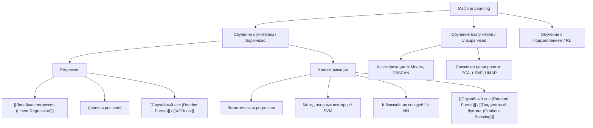

# ⚡ Все ключевые алгоритмы ML: Краткий обзор

> [!abstract] О материале
> Концентрированный экспресс-обзор фундаментальных алгоритмов машинного обучения: их назначение, принцип работы, плюсы и минусы, а также критерии выбора для решения прикладных задач.

---

## 🧭 Карта основных парадигм машинного обучения

---

## 📋 Сравнительная матрица алгоритмов

| Алгоритм | Тип задачи | Интерпретируемость | Скорость обучения | Устойчивость к переобучению | Когда применять |
| :--- | :--- | :---: | :---: | :---: | :--- |
| **[[Линейная регрессия (Linear Regression)]]** | Регрессия | 🟢 Высокая | ⚡ Мгновенно | 🟡 Средняя | Простые данные, бейзлайн, финансовый скоринг |
| **Логистическая регрессия** | Классификация | 🟢 Высокая | ⚡ Мгновенно | 🟡 Средняя | Бинарная классификация, вероятностные оценки |
| **k-NN (k-ближайших соседей)** | Классификация / Регрессия | 🟢 Высокая | ⚡ Обучения нет ($O(1)$) | 🔴 Низкая | Малые выборки, поиск похожих объектов |
| **Decision Tree (Дерево решений)** | Классификация / Регрессия | 🟢 Высокая | 🟢 Быстро | 🔴 Склонно к переобучению | Нелинейные пороги, понятные человеку правила |
| **[[Случайный лес (Random Forest)]]** | Классификация / Регрессия | 🟡 Средняя | 🟡 Средне | 🟢 Очень высокая | Табличные данные, минимум тюнинга гиперпараметров |
| **[[Градиентный бустинг (Gradient Boosting)]]** / **[[XGBoost]]** | Классификация / Регрессия | 🔴 Сложная | 🔴 Медленнее | 🟡 Требует регуляризации | Kaggle, максимальное качество на таблицах |
| **k-Means** | Кластеризация | 🟢 Высокая | ⚡ Быстро | 🟡 Зависит от инициализации | Сегментация клиентов, группировка данных |
| **PCA** | Снижение размерности | 🟡 Средняя | 🟢 Быстро | — | Борьба с мультиколлинеарностью, сжатие признаков |

---

## 🔗 Первоисточник и видеоматериалы

- 🎬 [Все алгоритмы ML за 17 минут — YouTube](https://www.youtube.com/watch?v=E0Hmnixke2g&list=PLnGUIPfqqH2Co_hBUDQctG1rUbTCUJ7yc&index=5)  
  *Наглядный видеообзор ключевых концепций и принципов работы классических методов ML.*
