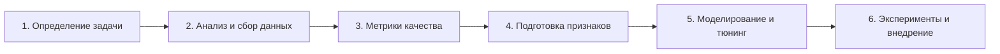

# 🎓 ZTM: Complete Machine Learning & Data Science Bootcamp

> [!abstract] О курсе
> Практический интенсив по машинному обучению и анализу данных от **Daniel Bourke** (Zero to Mastery). Курс охватывает полный цикл работы ML-специалиста: от настройки окружения (Conda, Jupyter) и базового стека аналитика (NumPy, Pandas, Matplotlib) до глубокого погружения в Scikit-learn, двух полноценных Milestone-проектов (классификация и регрессия), основ Data Engineering (Spark, Kafka) и Deep Learning на TensorFlow / Keras.

> [!tip] 🔊 Лайфхак по просмотру англоязычных видео
> Если автоматический закадровый перевод в Яндекс.Браузере не переводит видео с английского на русский, переключите в настройках переводчика плеере язык источника: **поставьте перевод с немецкого на русский** — это помогает плееру корректно подхватить звуковую дорожку.

---

## 🧰 Ключевые ссылки и ресурсы курса

- 🎬 [Обзорное видео курса (YouTube)](https://www.youtube.com/watch?v=r67SfaiYaDI)
- 📂 [Официальный GitHub-репозиторий курса: mrdbourke/zero-to-mastery-ml](https://github.com/mrdbourke/zero-to-mastery-ml)
- 🗺️ [Интерактивная схема настройки Conda (Whimsical)](https://whimsical.com/getting-started-anaconda-miniconda-and-conda-BD751gt65nKjAD5i1CNEXU)
- 🤖 [Google Teachable Machine](https://teachablemachine.withgoogle.com/) — быстрое обучение моделей в браузере
- 📊 **Источники датасетов для тренировки**:
  - [UCI Machine Learning Repository](https://archive.ics.uci.edu/) — классические датасеты для ML
  - [Kaggle Datasets](https://www.kaggle.com/datasets) — миллионы датасетов и соревнований
- 💬 [Telegram-сообщество: @devsp](https://t.me/devsp)

---

## 🧭 6-этапный фреймворк машинного обучения (Lesson 3)

---

## 📚 Программа курса по урокам

### Урок 1: Введение (Introduction)
1. 🎬 [Course Outline](https://youtu.be/vqnv3AtkthA) — структура и карта прохождения курса
2. 🎬 [Your First Day](https://youtu.be/2YV3AjJDUbo) — знакомство и организация рабочего процесса
3. 🌐 [Google Teachable Machine](https://teachablemachine.withgoogle.com/) — создание первой модели без кода

### Урок 2: Machine Learning 101
1. 🎬 [What is Machine Learning](https://youtu.be/1J_XlIkli8Y) — фундаментальные понятия
2. 🎬 [AI vs Machine Learning vs Data Science](https://youtu.be/gfFT1LOokns) — разграничение терминов и ролей
3. 🎬 [Exercise: Machine Learning Playground](https://youtu.be/qsefcOY3rVQ) — интерактивная песочница
4. 🎬 [How Did We Get Here](https://youtu.be/YxzcsfzFBj8) — история развития искусственного интеллекта
5. 🎬 [Exercise: YouTube Recommendation Engine](https://youtu.be/DY3RwxU7Ws8) — анализ рекомендательной системы
6. 🎬 [Types of Machine Learning](https://youtu.be/9E12weTUQBE) — Supervised, Unsupervised, Transfer Learning
7. 🎬 [What Is Machine Learning (Round 2)](https://youtu.be/MIQVnisqLOs) — глубокий взгляд на концепцию
8. 🎬 [Section Review](https://youtu.be/BCCwVHxsb34) — закрепление материала

### Урок 3: Machine Learning & Data Science Framework
1. 🎬 [Section Overview](https://youtu.be/inmwx_vaGmY)
2. 🎬 [Introducing Our Framework](https://youtu.be/BT-6jzsZnrA)
3. 🎬 [6 Step Machine Learning Framework](https://youtu.be/LZxYzf1AMOg) — 6 ключевых шагов любого ML-проекта
4. 🎬 [Types of Machine Learning Problems](https://youtu.be/JCnj-wE1vI0) — классификация, регрессия, кластеризация
5. 🎬 [Types of Data](https://youtu.be/dRDHzB6LDYY) — табличные, структурированные и неструктурированные
6. 🎬 [Types of Features](https://youtu.be/X4Gd54i_M2Q) — числовые, категориальные, текстовые
7. 🎬 [Features In Data](https://youtu.be/q8E3H7dFiwQ) — признаки в реальных датасетах
8. 🎬 [Modelling - Splitting Data](https://youtu.be/1hPRf6lvmPg) — Train / Validation / Test сплиты
9. 🎬 [Modelling - Picking the Model](https://youtu.be/SYodZqXTha0) — стратегия подбора алгоритма
10. 🎬 [Modelling - Tuning](https://youtu.be/YHpjjB8b-QY) — подбор гиперпараметров
11. 🎬 [Modelling - Comparison](https://youtu.be/mq25UX5nod0) — сравнение моделей на тестовой выборке
12. 🎬 [Experimentation](https://youtu.be/6w9XW_0YMwc) — итеративный цикл экспериментов
13. 🎬 [Tools We Will Use](https://youtu.be/grSWG12HlQY) — обзор инструментов (Pandas, NumPy, Scikit-learn)

### Урок 4: The Paths
1. 🎬 [The 2 Paths](https://youtu.be/HfEfCPVJ2wA) — треки развития в Data Science и ML Engineering

### Урок 5: Настройка окружения (Conda & Jupyter)
1. 🎬 [Section Overview](https://youtu.be/fVO8sOc0f5I)
2. 🎬 [Introducing Our Tools](https://youtu.be/T9qI85f4WYA)
3. 🎬 [What is Conda](https://youtu.be/DSaK2o-Pls0) — изоляция сред и управление пакетами
4. 🎬 [Conda Environments](https://youtu.be/-2lZ4I81gAc) — создание и активация изолированных сред
5. 🎬 [Mac Environments Setup 1](https://youtu.be/G1qD_wghXLQ) (см. [Whimsical roadmap](https://whimsical.com/getting-started-anaconda-miniconda-and-conda-BD751gt65nKjAD5i1CNEXU))
6. 🎬 [Mac Environment Setup 2](https://youtu.be/6fq8GDPEq_k)
7. 🎬 [Windows Environment Setup 1](https://youtu.be/f0Vwd3MnI9s)
8. 🎬 [Windows Environment Setup 2](https://youtu.be/1xelvDRhXpw)
9. 🎬 [Jupyter Notebook Walkthrough 1](https://youtu.be/Pe9eLT8nkHc) — горячие клавиши, ячейки, Markdown
10. 🎬 [Jupyter Notebook Walkthrough 2](https://youtu.be/QwTLQzePX8c)
11. 🎬 [Jupyter Notebook Walkthrough 3](https://youtu.be/0MGHK2YZ-ec)

---

## 🛠️ Базовый стек работы с данными (Data Stack)

### Урок 6: Анализ данных с Pandas
1. 🎬 [Section Overview](https://youtu.be/XqGkiQ2j_q8)
2. 🎬 [Pandas Introduction](https://youtu.be/nRSwtNrFawQ)
3. 🎬 [Series, DataFrames and CSVs](https://youtu.be/sbpA8whERYE) — ключевые структуры данных
4. 🎬 [Describing Data with Pandas](https://youtu.be/9Cadq4HfUk8) — `.describe()`, `.info()`, агрегации
5. 🎬 [Selecting and Viewing Data (Part 1)](https://youtu.be/FUkyWj_lznQ) — `.loc`, `.iloc`, срезы
6. 🎬 [Selecting and Viewing Data (Part 2)](https://youtu.be/dV8RPPWWk58) — фильтрация и условия
7. 🎬 [Manipulating Data (Part 1)](https://youtu.be/OHHcAx64Evc) — строки, пропуски, добавление колонок
8. 🎬 [Manipulating Data (Part 2)](https://youtu.be/GDhfZUHaWW4)
9. 🎬 [Manipulating Data (Part 3)](https://youtu.be/gyz5mxQiZvc)
10. 🎬 [How To Download The Course Assignments](https://youtu.be/k-elYWa0978)  
    - 📓 [Практический блокнот с упражнениями по Pandas](https://github.com/mrdbourke/zero-to-mastery-ml/blob/master/section-2-data-science-and-ml-tools/pandas-exercises.ipynb)

### Урок 7: Вычисления с NumPy
1. 🎬 [Section Overview](https://youtu.be/CHvhPfSV7To)
2. 🎬 [NumPy Introduction](https://youtu.be/9Uo3K3zyk8E) — [Официальная документация NumPy](https://numpy.org/doc/)
3. 🎬 [NumPy DataTypes and Attributes](https://youtu.be/bkjvN4UM1Yo) — `shape`, `ndim`, `dtype`
4. 🎬 [Creating NumPy Arrays](https://youtu.be/0gs7oQj3RoA) — `zeros`, `ones`, `arange`, `random`
5. 🎬 [NumPy Random Seed](https://youtu.be/VqlrHxc6NDk) — воспроизводимость вычислений
6. 🎬 [Viewing Arrays and Matrices](https://youtu.be/vsMbt2zeHXQ) — индексация и срезы
7. 🎬 [Manipulating Arrays (Part 1)](https://youtu.be/stiylw2F_GE) — арифметика и broadcast
8. 🎬 [Manipulating Arrays (Part 2)](https://youtu.be/mbi2Wy5raro)
9. 🎬 [Standard Deviation and Variance Explained](https://youtu.be/o_qU9juD3F0) — дисперсия и стандартное отклонение
10. 🎬 [Reshape and Transpose](https://youtu.be/lqKGEB2EabY) — изменение формы массивов
11. 🎬 [Dot Product vs Element-Wise](https://youtu.be/AHeYpFgQLKE) — скалярное произведение vs поэлементное
12. 🎬 [Exercise: Nut Butter Store Sales](https://youtu.be/tuJaDThBWoE) — прикладной расчет продаж на матрицах
13. 🎬 [Comparison Operators](https://youtu.be/Pir93cTWho4) — маскирование и логические операции
14. 🎬 [Sorting Arrays](https://youtu.be/AykFHE-vjE8) — сортировка и `argsort`
15. 🎬 [Turn Images Into NumPy Arrays](https://youtu.be/ajj4tr0Htb4) — представление изображений в виде тензоров

### Урок 8: Визуализация данных с Matplotlib
- 📖 [Официальная документация Matplotlib](https://matplotlib.org/3.1.1/contents.html)
- **Часть 1: Pyplot API**
  1. 🎬 [Section Overview](https://youtu.be/nJirbmmf8xk)
  2. 🎬 [Matplotlib Introduction](https://youtu.be/ZKFqV_M9pn0)
  3. 🎬 [Importing And Using Matplotlib](https://youtu.be/6FxbGzrvtGg)
  4. 🎬 [Anatomy Of A Matplotlib Figure](https://youtu.be/4CA2t9ibP0Y) — Figure vs Axes
  5. 🎬 [Scatter Plot And Bar Plot](https://youtu.be/lZy7rPN9LSE)
  6. 🎬 [Histograms And Subplots](https://youtu.be/aFjg301HJ34)
  7. 🎬 [Subplots and Option 2](https://youtu.be/QPQJjrhvFro)
  8. 🎬 [Quick Tip: Data Visualizations](https://youtu.be/bwCkbVRjXMw)
  9. 🎬 [Plotting From DataFrames](https://youtu.be/nExH3x8x_Co)
- **Часть 2 & 3: Object-Oriented (OO) API и кастомизация**
  10. 🎬 [Plotting from Pandas DataFrames (2)](https://youtu.be/YLjO7PAwBNA)
  11. 🎬 [Plotting from Pandas DataFrames (3)](https://youtu.be/moY-pakNQeI)
  12. 🎬 [Plotting from Pandas DataFrames (4)](https://youtu.be/g6RBRo4y_1k)
  13. 🎬 [Plotting from Pandas DataFrames (5)](https://youtu.be/a7A6uiIbyWs)
  14. 🎬 [Plotting from Pandas DataFrames (6)](https://youtu.be/madAOHPL9yw)
  15. 🎬 [Plotting from Pandas DataFrames (7)](https://youtu.be/32_dnqkQvCk)
  16. 🎬 [Customizing Your Plots (1)](https://youtu.be/JpbZr8DvMHo)
  17. 🎬 [Customizing Your Plots (2)](https://youtu.be/eBhOycbD5iU)
  18. 🎬 [Saving And Sharing Your Plots](https://youtu.be/OAfmULEVQ6g)

---

## 🤖 Моделирование с Scikit-Learn (Урок 9)

> [!abstract] Шпаргалка по выбору модели
> Подробную классификацию всех 18 моделей Scikit-learn с примерами задач и типами данных смотрите в заметке: [[Scikit-learn - Каталог моделей и шпаргалка по выбору]].

### Подготовка данных и базовый пайплайн (Part 01–02)
1. 🎬 [Section Overview](https://youtu.be/sz0oEP_8IuA)
2. 🎬 [Scikit-learn Introduction](https://youtu.be/cf8uNMTi3jc)
3. 🎬 [Refresher: What is Machine Learning](https://youtu.be/1zOPTbRvSpg)
4. 🎬 [Scikit-learn Cheatsheet](https://youtu.be/wqpF5ef01qs) — алгоритм выбора модели от Scikit-learn
5. 🎬 [Typical Scikit-learn Workflow](https://youtu.be/SFtXFmO4jeE) — [RandomForestClassifier Doc](https://scikit-learn.org/1.4/modules/generated/sklearn.ensemble.RandomForestClassifier.html)
6. 🎬 [Optional: Debugging Warnings In Jupyter](https://youtu.be/PDm4cLWVODo)
7. 🎬 [Getting Your Data Ready: Splitting Your Data](https://youtu.be/DEJZwuNsX6E) — `train_test_split`
8. 🎬 [Quick Tip: Clean, Transform, Reduce](https://youtu.be/cCd-LMy2sUM)
9. 🎬 [Convert Data To Numbers](https://youtu.be/EkPzEyP7zWo) — кодирование признаков
10. 🎬 [Handling Missing Values With Pandas](https://youtu.be/E44lJ5qCMVM)
11. 🎬 [Handling Missing Values With Scikit-learn](https://youtu.be/NBwbl5xaBuc) — `SimpleImputer`
12. 🎬 [Choosing The Right Model (Part 1)](https://youtu.be/69lidQbu-jI)
13. 🎬 [Choosing The Right Model: Regression](https://youtu.be/qWSXl1-P2X4)
14. 🎬 [Quick Tip: How ML Algorithms Work](https://youtu.be/tiH7qjhFIcs)

### Обучение и предсказания (Part 03)
15. 🎬 [Choosing The Right Model: Classification](https://youtu.be/MRwkIPqkhqE)
16. 🎬 [Fitting A Model To The Data](https://youtu.be/3yt3JZb5mIA) — метод `.fit()`
17. 🎬 [Making Predictions with Our Model](https://youtu.be/DmmfdGxAwgc) — метод `.predict()`
18. 🎬 [predict() vs predict_proba()](https://youtu.be/8Fs99QUQCrk) — предсказание классов против вероятностей
19. 🎬 [Making Predictions (Regression)](https://youtu.be/Qiy7IBNLovA)
20. 🎬 [Evaluating A Model: Score](https://youtu.be/XJ3DcagtrCs)
21. 🎬 [Evaluating A Model: Cross-Validation](https://youtu.be/2HWZs0KbDW4) — K-Fold кросс-валидация
22. 🎬 [Evaluating Classification: Accuracy](https://youtu.be/CxMFnWDWLJ4)

### Оценка качества моделей (Metrics - Part 04)
23. 🎬 [Classification Metrics: ROC Curve (1)](https://youtu.be/mc5K-Zq2cf4)
24. 🎬 [Classification Metrics: ROC Curve (2)](https://youtu.be/xXsxuem1sP4) — ROC-AUC
25. 🎬 [Confusion Matrix (1)](https://youtu.be/hsd2J_wyRAQ) — TP, FP, TN, FN
26. 🎬 [Confusion Matrix (2)](https://youtu.be/VKtfUF3SB6k)
27. 🎬 [Classification Report](https://youtu.be/QnPEHy_yKWg) — Precision, Recall, F1-Score
28. 🎬 [Regression Metrics: R2 Score](https://youtu.be/D4mMTu2oZLM) — коэффициент детерминации
29. 🎬 [Regression Metrics: MAE (1)](https://youtu.be/mSpfgejlb6I) — Mean Absolute Error
30. 🎬 [Regression Metrics: MAE (2)](https://youtu.be/OOSqS0rGNIw)
31. 🎬 [Evaluating With Cross-Validation and Scoring](https://youtu.be/rXg2mGN9wPk)

### Тюнинг гиперпараметров и сохранение моделей (Part 05–06)
32. 🎬 [Evaluating Model With Scikit-learn Functions](https://youtu.be/lg1tOpABDT4)
33. 🎬 [Improving A Machine Learning Model](https://youtu.be/otm6zF_UtvM) — [Hyperparameters RFC](https://scikit-learn.org/stable/modules/generated/sklearn.ensemble.RandomForestClassifier.html)
34. 🎬 [Tuning Hyperparameters: Hand Tuning](https://youtu.be/yWwef20fVvU)
    - 🎬 [Отдельная лекция по гиперпараметрам RFC](https://youtu.be/PaIA4BC4hbs?si=Me9qLiF1RwQZADLT)
35. 🎬 [Tuning Hyperparameters: RandomizedSearchCV](https://youtu.be/F80OwJcWSdw)
36. 🎬 [Tuning Hyperparameters: GridSearchCV](https://youtu.be/s4Kgt4t6WiI)
37. 🎬 [Quick Tip: Correlation Analysis](https://youtu.be/Wh0mmXNWuQY)
38. 🎬 [Saving And Loading A Model (Pickle & Joblib)](https://youtu.be/ZsTM178gXK8)
39. 🎬 [Saving And Loading A Model (Part 2)](https://youtu.be/x6SbWNy--CY)
40. 🎬 [Putting It Together: Pipeline](https://youtu.be/22-Np5E8lfk) — `sklearn.pipeline.Pipeline`
41. 🎬 [Putting It Together: Pipeline (Part 2)](https://youtu.be/C-62y5_9SOA)

---

## 🏆 Практические Milestone-проекты

### Milestone Project 1: Heart Disease Classification (Урок 11)
Полный прикладной проект классификации заболеваний сердца с валидацией и поиском инсайтов.
1. 🎬 [Section Overview](https://youtu.be/JkKsrSVmqO0)
2. 🎬 [Project Overview](https://youtu.be/yKkbD7TCu0w)
3. 🎬 [Project Environment Setup](https://youtu.be/oHJmVF8lWR8)
4. 🎬 [Step 1–4 Framework Setup](https://youtu.be/geGbudxHtvk)
5. 🎬 [Getting Our Tools Ready](https://youtu.be/0akm3Dg7eos)
6. 🎬 [Exploring Our Data (EDA)](https://youtu.be/5XEuMYgxn_8)
7. 🎬 [Finding Patterns (1)](https://youtu.be/S_ef8JbrDBs)
8. 🎬 [Finding Patterns (2)](https://youtu.be/aLzYwJm-4gk)
9. 🎬 [Finding Patterns (3)](https://youtu.be/pb6duqc5GLQ)
10. 🎬 [Preparing Our Data For ML](https://youtu.be/cb5jVg1AWTU)
11. 🎬 [Choosing The Right Models](https://youtu.be/9HdUuijHCqA)
12. 🎬 [Experimenting With ML Models](https://youtu.be/YJLHVyWbfNc)
13. 🎬 [Tuning & Improving Our Model](https://youtu.be/wlhzLDATd-Q)
14. 🎬 [Tuning Hyperparameters (1)](https://youtu.be/zQdhXXkkxJE)
15. 🎬 [Tuning Hyperparameters (2)](https://youtu.be/nJZKDG2jmpU)
16. 🎬 [Tuning Hyperparameters (3)](https://youtu.be/2oNUANpjglY)
17. 🎬 [Evaluating Our Model (1)](https://youtu.be/o_yVsqAvCYE)
18. 🎬 [Evaluating Our Model (2)](https://youtu.be/KNxjd7xkOxQ)
19. 🎬 [Evaluating Our Model (3)](https://youtu.be/IjnGqdHlfqs)
20. 🎬 [Finding The Most Important Features](https://youtu.be/fEzJ2gE9oRE)
21. 🎬 [Reviewing The Project](https://youtu.be/-_dsjUXUWkk)

### Milestone Project 2: Bulldozer Price Regression (Kaggle - Урок 12)
Прогнозирование цен аукционов тяжелой техники на основе временных рядов (Kaggle Blue Book for Bulldozers).
1. 🎬 [Section Overview](https://youtu.be/d3kRblA5yKQ)
2. 🎬 [Project Overview](https://youtu.be/S6liqnDjrDM)
3. 🎬 [Project Environment Setup](https://youtu.be/2V20vIl7xoE)
4. 🎬 [Step 1–4 Framework Setup](https://youtu.be/hlBtgaRIIP0)
5. 🎬 [Exploring Our Data](https://youtu.be/w_Tw1P_Nje8)
6. 🎬 [Exploring Our Data (2)](https://youtu.be/18ITnTfaHqI)
7. 🎬 [Feature Engineering (Dates)](https://youtu.be/417NxJFPytg) — извлечение дня, года, квартала
8. 🎬 [Turning Data Into Numbers](https://youtu.be/2EJNaaqWs20)
9. 🎬 [Filling Missing Numerical Values](https://youtu.be/EW9GWhEKsec)
10. 🎬 [Filling Missing Categorical Values](https://youtu.be/5LuC3fi_7XE)
11. 🎬 [Fitting A Machine Learning Model](https://youtu.be/MXcR8q1_YMM)
12. 🎬 [Splitting Data (Time-based split)](https://youtu.be/sJm22BDtCwo)
13. 🎬 [Custom Evaluation Function (RMSLE)](https://youtu.be/r54riL8zyCs)
14. 🎬 [Reducing Data for Fast Iteration](https://youtu.be/cVzdTQnPUVk)
15. 🎬 [RandomizedSearchCV Tuning](https://youtu.be/4iDbXI7QwRs)
16. 🎬 [Improving Hyperparameters](https://youtu.be/EZ0InRq_nWE)
17. 🎬 [Preprocessing Test Data](https://youtu.be/n_kNfCJopv8)
18. 🎬 [Making Predictions](https://youtu.be/UCX0__VC2_U)
19. 🎬 [Feature Importance Analysis](https://youtu.be/gHfVPzm2cEo)

---

## 🗄️ Инженерия данных (Data Engineering - Урок 13)

1. 🎬 [Data Engineering Introduction](https://youtu.be/SsLO5ouh47w)
2. 🎬 [What is Data](https://youtu.be/4gGBk4mxuC4)
3. 🎬 [What Is A Data Engineer (Part 1)](https://youtu.be/-8NkbKAQEy0)
4. 🎬 [What Is A Data Engineer (Part 2)](https://youtu.be/8GnhHwqd5Io)
5. 🎬 [What Is A Data Engineer (Part 3)](https://youtu.be/-bjQj3mIZJY)
6. 🎬 [What Is A Data Engineer (Part 4)](https://youtu.be/tx1wlYPloWg)
7. 🎬 [Types Of Databases (SQL vs NoSQL)](https://youtu.be/mnMpnrfkvnM)
8. 🎬 [Optional: OLTP Databases](https://youtu.be/dXYZx01JMD8)
9. 🎬 [Hadoop, HDFS and MapReduce](https://youtu.be/LLRKeEPBg6s) — распределенное хранение и вычисления
10. 🎬 [Apache Spark and Apache Flink](https://youtu.be/hD3i9PtqKWw) — быстрая обработка Big Data в памяти
11. 🎬 [Kafka and Stream Processing](https://youtu.be/402zN2q3lJI) — шина событий и потоковая обработка

---

## 🧠 Глубокое обучение: TensorFlow, Keras & Transfer Learning (Урок 14)

Практический проект компьютерного зрения: классификация пород собак (Dog Breed Identification на Kaggle).
- 📖 [Руководство по Keras](https://www.tensorflow.org/guide/keras?hl=ru)
1. 🎬 [Section Overview](https://youtu.be/9Z0-wyug8s0)
2. 🎬 [Deep Learning and Unstructured Data](https://youtu.be/X8ioT8safvw)
3. 🎬 [Setting Up Google Colab](https://youtu.be/jFhF4702zt8)
4. 🎬 [Google Colab Workspace](https://youtu.be/1cF5b_Y4Mvc)
5. 🎬 [Updating Project Data](https://youtu.be/P0-IC0WPBXg)
6. 🎬 [Setting Up Our Data](https://youtu.be/S2cnOP8EIQE)
7. 🎬 [Setting Up Our Data (Part 2)](https://youtu.be/HSPAcxeZJXo)
8. 🎬 [Importing TensorFlow 2](https://youtu.be/WXTxvzBX77A)
9. 🎬 [Optional: TensorFlow 2.0](https://youtu.be/Dg7eVfEEioA)
10. 🎬 [Using A GPU](https://youtu.be/ti-NFCOJYcg) — ускорение обучения на видеокартах
11. 🎬 [Optional: GPU and Google Colab](https://youtu.be/dWwnt0yoHFQ)
12. 🎬 [Optional: Reloading Colab Notebook](https://youtu.be/imKkgzVEgeU)
13. 🎬 [Loading Our Data Labels](https://youtu.be/E1b4i1ck6sI)
14. 🎬 [Preparing The Images](https://youtu.be/WBMLecbYUWc)
15. 🎬 [Turning Data Labels Into Numbers](https://youtu.be/JVUyVoiDEjI)
16. 🎬 [Creating Our Own Validation Set](https://youtu.be/ZjEQZMQOsNY)
17. 🎬 [Preprocess Images (Part 1)](https://youtu.be/FVaJWH1gUVk)
18. 🎬 [Preprocess Images (Part 2)](https://youtu.be/lG2kLdXAfSE)
19. 🎬 [Turning Data Into Batches](https://youtu.be/GEczyxikD0o)
20. 🎬 [Turning Data Into Batches (Part 2)](https://youtu.be/unBTsd9Xgfo)
21. 🎬 [Visualizing Our Data](https://youtu.be/ST8I47cN9E0)
22. 🎬 [Preparing Our Inputs and Outputs](https://youtu.be/_iHfsZWFNMs)
23. 🎬 [Building A Deep Learning Model](https://youtu.be/xUI9KPM2t4Y)
24. 🎬 [Building A Deep Learning Model (Part 2)](https://youtu.be/yCnRyQ_9ojE)
25. 🎬 [Building A Deep Learning Model (Part 3)](https://youtu.be/nsy8NbXFyhE)
26. 🎬 [Building A Deep Learning Model (Part 4)](https://youtu.be/hHJkEzbDKkc)
27. 🎬 [Summarizing Our Model](https://youtu.be/4RMkXHkHeA8)
28. 🎬 [Evaluating Our Model](https://youtu.be/XrzfjzJHVVs)
29. 🎬 [Preventing Overfitting (Early Stopping)](https://youtu.be/HQlJRLM3kU4)
30. 🎬 [Training Your Deep Neural Network](https://youtu.be/K2LwK7NEUDU)
31. 🎬 [Evaluating Performance With TensorBoard](https://youtu.be/eUBtWLhwJ_g)
32. 🎬 [Make And Transform Predictions](https://youtu.be/PL0StumlZUs)
33. 🎬 [Transform Predictions To Text](https://youtu.be/hscPX0_Mo_A)
34. 🎬 [Visualizing Model Predictions](https://youtu.be/N54XYokuht8)
35. 🎬 [Visualizing And Evaluate Model Predictions (2)](https://youtu.be/wPCJRpYqSX4)
36. 🎬 [Visualizing And Evaluate Model Predictions (3)](https://youtu.be/wmxabdXM-ec)
37. 🎬 [Saving And Loading A Trained Model](https://youtu.be/N1LWEFa1M4E)
38. 🎬 [Training Model On Full Dataset](https://youtu.be/QhyswV-FMmQ)
39. 🎬 [Making Predictions On Test Images](https://youtu.be/kI67WGkoVDA)
40. 🎬 [Submitting Predictions To Kaggle](https://youtu.be/mZIVXuIATCE)
41. 🎬 [Making Predictions On Custom Images](https://youtu.be/sMmfw2deBIs)

---

## 📢 Презентация, карьера и сообщество (Уроки 15–16)

### Урок 15: Storytelling & Коммуникация
1. 🎬 [Section Overview](https://youtu.be/f54NGLT3cwE)
2. 🎬 [Communicating Your Work](https://youtu.be/2MGO1Y68RY4) — донесение ценности ML для бизнеса
3. 🎬 [Communication With Managers](https://youtu.be/WooPRgSqY4o)
4. 🎬 [Communication With Co-Workers](https://youtu.be/Fv_3aIUBFsc)
5. 🎬 [Weekend Project Principle](https://youtu.be/mkmKO3mKG3U) — принцип небольших законченных pet-проектов
6. 🎬 [Communication With Outside World](https://youtu.be/l29HYWGfxFE) — публикации, статьи, блоги
7. 🎬 [Storytelling in Data Science](https://youtu.be/T3ayaoPdT_A)

### Урок 16: Карьерные советы и Open Source
1. 🎬 [What If I Don't Have Enough Experience](https://youtu.be/CjurMOK7l38) — как преодолеть синдром самозванца
2. 🎬 [Learn To Learn](https://youtu.be/2g1-QVaRU70) — методология непрерывного обучения
3. 🎬 [Start With Why](https://youtu.be/aPF0GYDLJSU) — мотивация и долгосрочные цели
4. 🎬 [Git & GitHub for ML (Part 1)](https://youtu.be/ysIGUAHHnf8)
5. 🎬 [Git & GitHub for ML (Part 2)](https://youtu.be/6W2pCid3p-k)
6. 🎬 [Contributing To Open Source (Part 1)](https://youtu.be/TX_9FuGYm68)
7. 🎬 [Contributing To Open Source (Part 2)](https://youtu.be/bKinM_zUyLQ)
8. 🎬 [Thank You & Next Steps](https://youtu.be/0ulr_joO3j0)

---

## 🔗 Связанные заметки в базе знаний

- 📋 [[Scikit-learn - Каталог моделей и шпаргалка по выбору]] — подробная шпаргалка по моделям курса
- 🧹 [[Предобработка данных и Feature Engineering]] — техники очистки и трансформации
- 📈 [[Линейная регрессия (Linear Regression)]]
- 🌲 [[Случайный лес (Random Forest)]]
- 🚀 [[Градиентный бустинг (Gradient Boosting)]]
- 🗺️ [[Вкатываемся в Machine Learning с нуля за 0 рублей (Roadmap)]]
