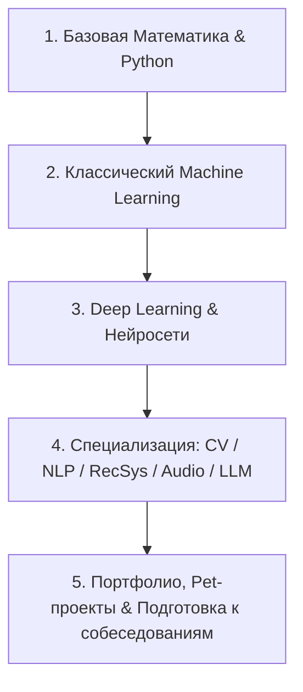

# 🗺️ Вкатываемся в Machine Learning с нуля за 0 рублей

> [!abstract] О материале
> Практический пошаговый гайд от исследовательницы машинного обучения (ML Researcher) Лаиды Кушнаревой о том, как системно освоить Machine Learning самостоятельно без платных курсов. Материал объединяет проверенные бесплатные курсы, видеолекции и интерактивные тренажеры.
>
> 🔗 **Первоисточник**: [Хабр — Вкатываемся в Machine Learning с нуля за ноль рублей: что, где, в какой последовательности изучить](https://habr.com/ru/articles/774844/)

---

## 🧭 Пошаговый трек обучения

---

## 1. Предварительные знания (Pre-requisites)

### 1.1. Математический фундамент

> [!tip] Главное правило
> Не нужно решать олимпиадные интегралы — главное свободно обращаться с векторами, матрицами и понимать геометрический смысл производных.

- **Интуиция за 15 минут**:
  - 🎬 [3blue1brown: Essence of Linear Algebra](https://www.youtube.com/playlist?list=PLZHQObOWTQDPD3MizzM2xVFitgF8hE_ab) (Векторы, матрицы, определители, собственные векторы)
  - 🎬 [3blue1brown: Essence of Calculus](https://www.youtube.com/playlist?list=PLZHQObOWTQDMsr9K-rj53DwVRMYO3t5Yr) (Пределы, производные, частные производные)
- **Линейная алгебра**:
  - 🎓 [Stepik 2461: Линейная алгебра](https://stepik.org/course/2461) (Для тех, кто повторяет вузовскую базу)
  - 🎓 [Khan Academy: Linear Algebra](https://www.khanacademy.org/math/linear-algebra) (Подробный визуальный курс с нуля)
- **Математический анализ**:
  - 🎓 [Stepik 95: Математический анализ](https://stepik.org/course/95/syllabus) (Модули 1–3: функции, пределы, производные сложной функции)
  - 🎓 [Khan Academy: Calculus 1](https://www.khanacademy.org/math/calculus-1)
- **Теория вероятностей и статистика**:
  - 🌐 [Seeing Theory (Brown University)](https://seeing-theory.brown.edu/basic-probability/index.html) (Интерактивная визуализация теории вероятностей)
  - 🎓 [Stepik 326: Основы статистики (Анатолий Карпов)](https://stepik.org/course/326/syllabus)

### 1.2. Программирование: Python и инструменты

- 🐍 [Stepik 512: Программирование на Python](https://stepik.org/course/512) (Синтаксис, структуры данных, работа с API, парсинг данных)
- 🐍 [Stepik 67: Python: основы и применение](https://stepik.org/course/67) (Если программируете впервые)
- 🐍 [Поколение Python (Stepik 58852 & 68343)](https://stepik.org/course/58852) (Огромное количество практических задач для набивания руки)
- 📓 [ODS pycourse: Практика Python и Jupyter](https://open-data-science.github.io/pycourse/base) (Инструментарий ML-разработчика)
- 🗄️ [Stepik 63054: Интерактивный тренажер по SQL](https://stepik.org/course/63054) (SQL необходим для выгрузки данных и подготовки датасетов)

---

## 2. Классическое машинное обучение

- 🌐 [MLU-Explain](https://mlu-explain.github.io/) — визуальные статьи от Amazon о работе деревьев, регрессий и метрик.
- 🎓 [Stepik: Введение в Data Science и машинное обучение](https://stepik.org/course/4852/)
- 🎓 [mlcourse.ai (OpenDataScience / Юрий Кашницкий)](https://mlcourse.ai/book/index.html) — легендарный открытый курс с состязаниями на Kaggle.
- 🎓 [[Курс Машинного Обучения ФКН ВШЭ (Евгений Соколов)]] — фундаментальная университетская программа.
- 🎓 [К. В. Воронцов (МФТИ / МГУ)](http://www.machinelearning.ru/wiki/index.php?title=%D0%9C%D0%B0%D1%88%D0%B8%D0%BD%D0%BD%D0%BE%D0%B5_%D0%BE%D0%B1%D1%83%D1%87%D0%B5%D0%BD%D0%B8%D0%B5_%28%D0%BA%D1%83%D1%80%D1%81_%D0%BB%D0%B5%D0%BA%D1%86%D0%B8%D0%B9%2C_%D0%9A.%D0%92.%D0%92%D0%BE%D1%80%D0%BE%D0%BD%D1%86%D0%BE%D0%B2%29) — классическая математическая база.

---

## 3. Глубокое обучение (Deep Learning)

- 🎓 [Stepik: Нейронные сети (Stepik 50352)](https://stepik.org/course/50352)
- 🎓 [Stepik: Практический Deep Learning (Stepik 54098)](https://stepik.org/course/54098)
- 🎓 [Deep Learning School (DLS ФПМИ МФТИ)](https://stepik.org/course/124069) — один из лучших бесплатных курсов на русском языке (2 семестра с проектами).
- 📖 [The Little Book of Deep Learning (François Fleuret)](https://fleuret.org/public/lbdl.pdf) — карманный конспект по DL.

---

## 4. Карьера и собеседования

- 💼 Подготовка резюме: отражение не просто названий моделей, а конкретных бизнес-метрик и задач (EDA, Feature Engineering, валидация, деплой).
- 🧠 Алгоритмическая подготовка: LeetCode (Easy/Medium) + знание ML-алгоритмов под капотом (вывод формул градиентного спуска, устройство решающих деревьев).
- 👥 Сообщества: Open Data Science ([ODS.ai](https://ods.ai/)), чаты и каналы для нетворкинга.

---

## 🔗 Связанные заметки в базе знаний

- 📐 [[Градиент функции (Function Gradient)]]
- 📉 [[Градиентный спуск (Gradient Descent)]]
- 📈 [[Линейная регрессия (Linear Regression)]]
- 🌲 [[Случайный лес (Random Forest)]]
- 🚀 [[Градиентный бустинг (Gradient Boosting)]]
- ⚡ [[XGBoost]]
- 🧹 [[Предобработка данных и Feature Engineering]]
- 🔥 [[PyTorch - Datasets & DataLoaders]]
- 🎓 [[Курс Машинного Обучения ФКН ВШЭ (Евгений Соколов)]]
